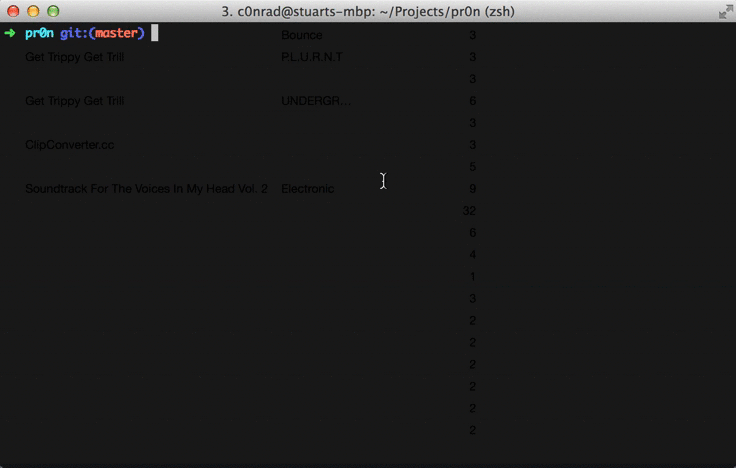

# pr0n

Flying rainbow peni.



Video Demo:
https://www.youtube.com/watch?v=SMmvkLPJkAE

Unstable.

## Install

```
make build
make run
```

By default it spawns a server and an AI to play.

To play networked mode, spawn a server on one machine:

    ./pr0n --serve --host c0nrad.io --port :1337 --size 2

Then have two people connect:

    ./pr0n --host c0nrad.io --port :1337

## Options

    --ai: This client will play as a bot
    --server: Run as a server
    --host: connect/bind to this host
    --port: connect/bind to this port
    --local

## Contact

c0nrad.io

Enjoy :D
